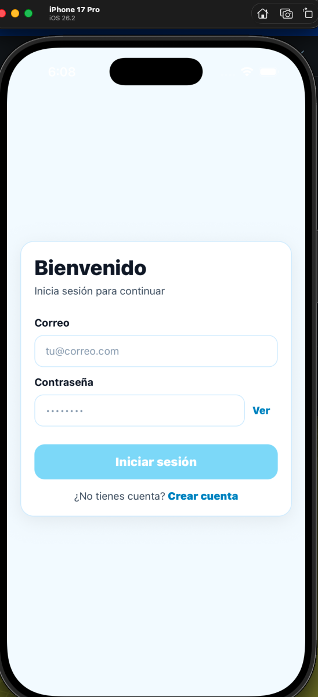
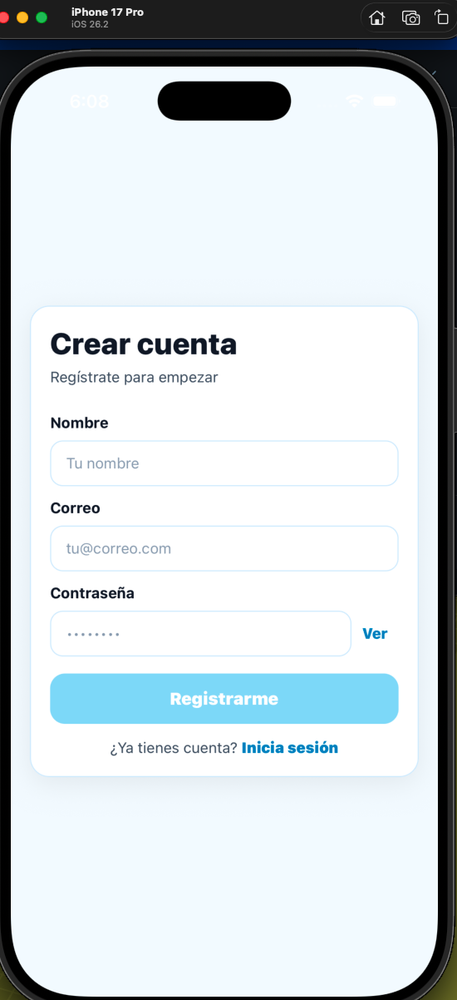
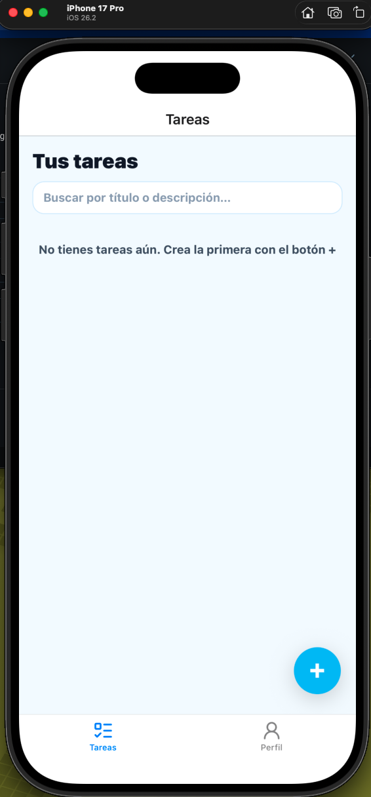
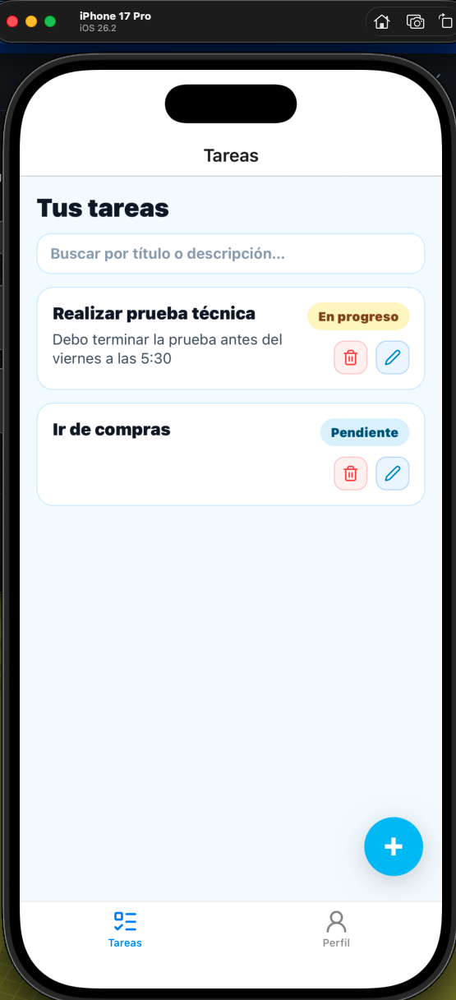
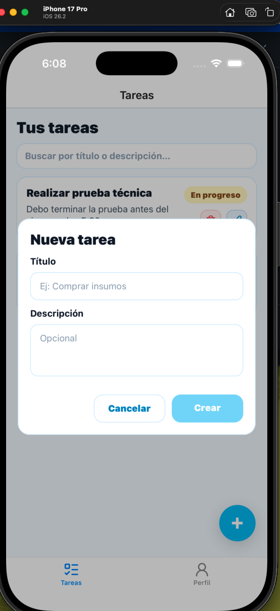

Task Manager – Mobile App

Aplicación móvil desarrollada en React Native con Expo como parte de una prueba técnica.
Consume un API REST autenticado, permitiendo a los usuarios gestionar sus tareas personales.

🎯 Objetivo de la app

Demostrar habilidades como Mobile Developer, con énfasis en:

Arquitectura de aplicaciones móviles

Manejo de estado y comunicación con APIs

Buenas prácticas en React Native

Código legible, modular y testeable

✅ Funcionalidades implementadas

Registro de usuario

Inicio de sesión

Persistencia de sesión (token)

Listado de tareas del usuario autenticado

Crear tarea

Editar tarea

Eliminar tarea

Manejo de estados:

Loading

Error

Validaciones básicas en formularios

🧠 Arquitectura y decisiones técnicas
Patrón Container–Presenter

Se aplicó el patrón Container–Presenter para separar responsabilidades:

Containers

Manejan estado

Orquestan llamadas a hooks y servicios

Conectan la lógica con la UI

Presenters / Components

UI pura

Sin lógica de negocio

Reutilizables y fáciles de testear

Esto mejora:

mantenibilidad

testabilidad

legibilidad del código

📁 Estructura del proyecto
src/
├── api/            → Configuración de Axios y endpoints
├── components/     → Componentes UI reutilizables
├── screens/        → Pantallas principales (Login, Tasks, etc.)
├── hooks/          → Hooks personalizados (ej. useTasks)
├── navigation/     → Stack y Tab navigators
├── services/       → Lógica de negocio y comunicación con API
└── store/          → Manejo de estado global (Context)

Esta estructura sigue la sugerida en la prueba técnica.

🌐 Comunicación con la API

Se utiliza Axios para consumir el backend.

La URL base del API se configura mediante variables de entorno.

Todas las llamadas se realizan a endpoints autenticados.

Ejemplo de configuración:

EXPO_PUBLIC_API_URL=http://<IP_LOCAL>:8000

🔐 Manejo de autenticación y sesión

El token de autenticación se guarda usando SecureStore (Expo).

La sesión se restaura automáticamente al abrir la app.

Todas las peticiones protegidas incluyen el token en el header Authorization.

Esto garantiza:

Persistencia de sesión

Seguridad básica de credenciales

⏳ Manejo de estados y errores

Indicadores de loading durante llamadas a la API

Manejo centralizado de errores

Mensajes claros al usuario en caso de fallo

Deshabilitación de acciones mientras hay procesos en curso

🧪 Tests unitarios

Se implementaron tests unitarios con Jest, enfocados en la lógica de negocio.

Ejemplo:

Tests del hook useTasks

Carga inicial de tareas

Crear, actualizar y eliminar tareas

Manejo de errores

Refresh manual

Los servicios de API se mockean para evitar llamadas reales al backend.

Ejecutar tests
yarn test

⚙️ Instalación y ejecución
Requisitos

Node.js (18+ recomendado)

Yarn

Expo CLI

Expo Go (iOS o Android)

Configuración de entorno

Crear el archivo .env en la raíz de mobile-app:

EXPO_PUBLIC_API_URL=http://IP_LOCAL:8000

Ejemplo:

EXPO_PUBLIC_API_URL=http://192.168.1.25:8000

El dispositivo debe estar en la misma red Wi-Fi que el backend.

Ejecutar la aplicación
yarn install
npx expo start

Se mostrará un QR en la terminal

Abrir Expo Go

Escanear el QR

La app se abrirá y se conectará al backend

📝 Notas finales

La app está diseñada para ser simple, clara y mantenible

Se priorizó una arquitectura limpia sobre soluciones rápidas

El código está organizado para facilitar futuras extensiones:

Offline support

Mejoras UX

Tests adicionales

🔧 Posibles mejoras (no implementadas)

Soporte offline con cache local

Acciones por swipe en la lista de tareas

Filtros por estado

Animaciones y micro-interacciones

CI/CD para ejecución automática de tests

## APP FUNCIONANDO

### Login

### Registro

### Lista de tareas

### Crear tarea

### Editar tarea

